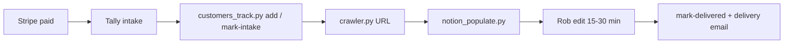

# Customer 10 runbook — what to do when you hit 10 paying customers

**Gate:** Do not start **BL-14** (Playwright crawler) or **BL-15** (Notion auto-population) until you have **10 paying customers** recorded and you have completed the checklist below.

**Verify count:**

```bash
python scripts/customers_track.py stats
python scripts/customers_track.py acknowledge-milestone-10   # after you read this doc
```

Tracking setup: [`CUSTOMER-TRACKING.md`](CUSTOMER-TRACKING.md)

---

## Why customer 10 exists

| Before 10 | After 10 |
|-----------|----------|
| Manual audit only (~15 min checklist) | Manual audit **plus** crawler assist |
| You write every finding from scratch | Crawler JSON pre-fills candidate findings |
| ~5 hrs/week sustainable | Automation must **save** time, not create review debt |

The crawler captures raw observations; **you still curate** every customer-facing sentence ([`templates/report-voice-guide.md`](../templates/report-voice-guide.md)).

---

## Phase 0 — Confirm you're ready (1 hour)

- [ ] **10 paying customers** in `data/customers.json` (not 10 Looms, not 10 free samples)
- [ ] **At least 6 delivered** reports you would call "useful" (60-day target)
- [ ] [`templates/manual-audit-checklist.md`](../templates/manual-audit-checklist.md) feels repeatable in ~15–25 min
- [ ] [`templates/notion/crawler-wishlist.md`](../templates/notion/crawler-wishlist.md) has **10+** "crawler should check this" notes from real audits
- [ ] Findings library stable — no major gaps from last 5 deliveries ([`findings_library/findings.json`](../findings_library/findings.json))
- [ ] `.env` has `NOTION_TOKEN`, `NOTION_CUSTOMERS_DB_ID`, `NOTION_FINDINGS_DB_ID`
- [ ] Time budget: **10–12 hours** over 2 weeks for BL-14 + BL-15 (per [`03-build-queue.md`](03-build-queue.md))

**Stop if:** deliveries are slipping past SLA, refunds are rising, or you're still fixing Tally/Stripe/E2E. Fix ops first.

---

## Phase 1 — Environment (30 min)

```bash
pip install -e ".[crawler]"
playwright install chromium
```

`.env` additions:

```env
HEADLESS=true
# Optional: NOTION_REPORTS_PARENT_PAGE_ID for BL-15
```

Smoke test:

```bash
python scripts/notion_test.py --list-customers
python scripts/findings_lookup.py placeholder
```

---

## Phase 2 — BL-14 Playwright crawler v0.1 (6–8 hours)

**Goal:** `python scripts/crawler.py <url> --output output/scans/` → JSON + screenshots.

**Must capture** (see [`05-technical-architecture.md`](05-technical-architecture.md)):

| Area | Output |
|------|--------|
| Desktop + mobile viewport | PNG screenshots per key route |
| Console | JS errors on load |
| Network | 4xx/5xx on critical requests |
| Links | Internal hrefs → status |
| Placeholders | Match [`findings_library/placeholder_patterns.json`](../findings_library/placeholder_patterns.json) |
| Trust pages | `/privacy`, `/terms`, contact |
| Meta | title, description (platform defaults) |
| Logged-out | `/dashboard`, `/settings` redirect (no credentials stored) |

**Must not:**

- Submit forms or payments
- Store real user passwords (test accounts: env-only, delete after scan)
- Run without `LaunchLook-Crawler/0.1` user-agent

**Acceptance tests:**

1. `python scripts/crawler.py https://launchlook.app` — completes, valid JSON
2. Same on one Lovable customer staging URL (with permission)
3. JSON includes `pages_crawled`, `console_errors`, `placeholder_matches`

**File to create:** `scripts/crawler.py` (skeleton may exist as TODO in repo — implement per BL-14)

**Wishlist → spec:** For each line in Notion **Crawler Wishlist**, add a check to crawler or document "manual only."

---

## Phase 3 — BL-15 Notion pre-population (4 hours)

**Goal:** `python scripts/notion_populate.py --scan output/scans/xxx.json --customer <notion_page_id> --platform Lovable`

**Behavior:**

1. Load crawler JSON
2. Map observations → findings library IDs ([`06-findings-library.md`](06-findings-library.md))
3. Duplicate customer report template (Starter vs Full)
4. Insert finding blocks: severity, plain-English explanation, fix prompt for platform
5. Leave Rob sections empty: qualitative gut check, QSG narrative, screenshot captions

**Acceptance:**

- One real scan → Notion draft with **≥3** auto findings, all editable
- No finding published without Rob opening the page once

---

## Phase 4 — New delivery workflow (ongoing)



| Step | Tool | Time |
|------|------|------|
| Register payment | `customers_track.py add` | 1 min |
| Crawl | `crawler.py` | 2–5 min run |
| Draft report | `notion_populate.py` | 1 min + your edits |
| Curate + QSG | Manual + `qsg_compose_prompt.py` | 15–30 min |
| Send | `email_render.py` + delivery template | 5 min |

**SLA:** Starter within 48h (usually 24) · Full within 24h (usually 12), measured from intake submission.

---

## Phase 5 — Automation you may add (optional, after crawler works)

| Item | BL ID | When |
|------|-------|------|
| Day-3 follow-up cron | BL-13 | After 2+ customers get follow-ups without errors |
| Stripe webhook → email you | — | When manual `add` becomes annoying |
| Welcome email via Resend | BL-13 | Domain verified |
| GitHub Action weekly `stats` | — | Nice-to-have |

Do **not** build customer dashboard or self-serve UI until **~customer 30** ([`03-build-queue.md`](03-build-queue.md) anti-queue).

---

## Phase 6 — Quality bar after automation

After each of the **next 3** deliveries post-crawler:

- [ ] Did crawler save **≥15 minutes** vs pure manual?
- [ ] Zero false-critical findings (don't erode trust)
- [ ] Customer still rates useful or better
- [ ] You updated crawler-wishlist with misses

If crawler creates more review work than it saves, **pause BL-15** and run crawler as optional "notes only" until v0.2.

---

## Phase 7 — Pricing / capacity (at 10, not before)

Consider only after 10 smooth deliveries:

- Raise Starter **$9 → $12** or Full **$29 → $39**
- Cap concurrent audits per week (e.g. max 3 active)
- Pause outreach if delivery due dates stack

Document decision in [`02-strategy-and-context.md`](02-strategy-and-context.md).

---

## Quick reference commands

```bash
# Milestone
python scripts/customers_track.py stats

# Crawl (after BL-14 ships)
python scripts/crawler.py "https://customer-app.com" --output output/scans/

# Populate (after BL-15 ships)
python scripts/notion_populate.py --scan output/scans/latest.json --customer <page_id> --platform Lovable

# Deliver
python scripts/customers_track.py mark-delivered cust_xxx --notion-report-url "https://notion.so/..."
python scripts/email_render.py delivery --name Sam --app-name "App" --report-link "..." --platform Lovable
```

---

## Explicitly still out of scope at customer 10

- Supabase / customer database SaaS
- Public anonymous scanner
- Auto-send reports without human review
- Security pentest positioning
- Mobile native apps

---

## When customer 10 is *not* the right trigger

Use **delivered + useful reports** as the real signal. If you have 10 payments but only 4 delivered reports, finish deliveries first.

**Alternative gate:** 10 **delivered** reports with manual process — then unlock crawler.

Adjust `data/milestones.json` if you prefer that rule; default today is **10 paying** per build queue.

---

*After completing Phase 0–3, check off BL-14 and BL-15 in [`03-build-queue.md`](03-build-queue.md) and update [`ROB-REMAINING-TODO.md`](ROB-REMAINING-TODO.md).*
